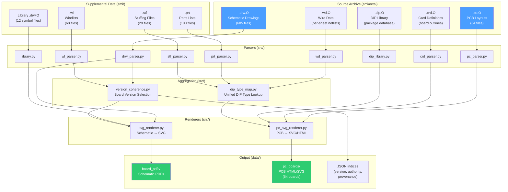

# SUDS DRW → SVG Conversion Tools

**Stanford University Drawing System (SUDS) — Modern Format Recovery Project**

This project decodes and renders archival SUDS `.DRW` schematic drawing files
and `.PC` board layout files from the Stanford AI Lab (SAIL) / Sun Microsystems
era into modern SVG vector graphics.

## What is SUDS?

SUDS was a pioneering schematic CAD system developed at Stanford in the early 1970s,
running on PDP-10 mainframes under the WAITS operating system. It was used to design:

- The **Super Foonly** — a SAIL project (1970–1972) whose design was completed but
  cancelled before hardware was built. The later **Foonly F-1**, a redesign by the
  Foonly Inc company in the late 1970s, was delivered to III (Information International
  Inc) for use in computer-generated graphics for motion pictures.
- The **DEC KL10** — DEC obtained SUDS (and/or the Super Foonly design) and adapted
  it internally. The KL10 was designed using SUDS as a stripped-down Super Foonly.
  In return, SAIL received a KL10.
- The **S-1 Supercomputer** (SCALD/SUDS at LLNL)
- The original **Sun-1** and **Sun-2** workstations (by Andy Bechtolsheim at Stanford)

SUDS was also ported to ITS at the MIT AI Lab, where it was used to design:

- The **XGP interface** (Xerox Graphics Printer)
- **Knight TV** terminals
- The **CHEOPS** chess accelerator
- The **CONS** and **CADR** Lisp machines

The DRW files in this archive contain the actual schematics for Sun Microsystems
boards drawn by Andy Bechtolsheim and others.

## Data Flow



## Data Sources

| Source | Location | Description |
|--------|----------|-------------|
| SMI Archive | `../smi/` | SAILDART dump of `[*,SMI]` — Sun Microsystems Inc files |
| SMI Octal | `../smi/octal/` | 685 binary `.drw.O` files (36-bit words in octal format) |
| SUDS Repo | `../../saildart/SUDS/` | PDP-10/SUDS GitHub repo with tools & docs |
| PDP-10 Source | `../../saildart/SUDS/bits/saildart/` | Authoritative DRAW program assembly source |

> See [`data/README.md`](data/README.md) for detailed data directory layout,
> file extension reference, and regeneration instructions.

## Component Designators

- Designators are from WL files, not DRW
- Convention: [Prefix][Page*100+Seq]
- Batch renderer automatically overlays designators on SVG output

## Board Grouping & Version Selection

### Designator-First Coherence Algorithm

Each board prefix (e.g., `x`, `q`, `a`) may contain DRW pages from multiple
design revisions. The coherence algorithm identifies and separates these into
distinct version sets:

1. **Board designator extraction** — strips copyright prefixes from `title_line_1`
   to extract the board identity (e.g., "SUN-3/F", "SUN 68010")
2. **Clustering** — groups pages by `(designator, of_total)` pairs
3. **Merging** — joins related designators (e.g., SUN-3 + SUN-3/F when same "of")
4. **Scoring** — weighted formula: `0.35×desig + 0.20×of + 0.20×coverage + 0.15×wl + 0.10×size`
5. **Ranking** — highest-scoring version set is marked `_BEST`

### Data Authority Hierarchy

```
WL header (per-page board name)     ★★★★★  Highest — preserves original mapping
DRW trailer (board designator)      ★★★★☆  May be stale if file overwritten
DRW "Page X of Y" consistency      ★★★☆☆  Self-declared page total
BOM/WD cross-reference             ★★☆☆☆  Confirmation signal
```

### Comprehensive Version Index

All **2,215 DRW files** across `smi/octal/` (685 latest) and `smi/prev/` (1,530
older versions) are indexed in `data/drw_version_index.json`. For each file, the
index records: board designator, page number, page-of total, file date, size, and
body count.

The canonical best version of each page is selected by the coherence algorithm,
which may pull from version history when an older version produces a more coherent
board set. For example, `g1.drw.O` through `g5.drw.O` use `prev/v1-v2` versions
(SUN GRAPHICS, 7/7 pages, score 0.85) instead of the latest versions.

The complete pipeline:
```
build_version_index.py → build_canonical_sets.py → populate_best_versions.py → batch_render.py → generate_index.py
```

### WL Authority Map

The `data/wl_authority.json` file contains per-page board identity extracted from
66 wirelist file headers. Each entry records the board name, page function, sheet
number, and date from when the wirelist was generated. This is the highest-authority
source for page-to-board assignment.

## Output

### Schematic PDFs (`data/board_pdfs/`)

- **`data/board_pdfs/index.html`** — Browse all boards with provenance info
- **`data/board_pdfs/{board_id}/{board_id}_v{N}_..._{BEST}.pdf`** — Best version per board
- Each PDF filename encodes: version number, board designator, page total, coherence score

### PCB Board Renders (`data/pc_boards/`)

- **64 interactive HTML/SVG** renderings of all PC board layout files
- Multi-layer visualization with toggleable traces, pads, vias, and bodies
- Component labels sourced from PRT, WD, and STF files via unified DIP type lookup

## Project Structure

```
suds-tools/
├── README.md                       # This file
├── docs/
│   ├── journey.md                  # Research journal & findings (10 checkpoints)
│   ├── drw_format.md               # DRW file format specification
│   ├── suds_format_reference.md    # Complete SUDS technical reference
│   ├── file_inventory.md           # Index of all DRW files found
│   └── version_selection.md        # Version recovery & coherence algorithm docs
├── src/
│   ├── word36.py                   # 36-bit PDP-10 word primitives
│   ├── unpack.py                   # Binary format decoder (octal/ITS)
│   ├── drw_model.py                # Data model (13 dataclasses)
│   ├── drw_parser.py               # DRW binary parser (all 13 sections)
│   ├── svg_renderer.py             # SVG rendering engine (schematics)
│   ├── pc_model.py                 # PC board data model
│   ├── pc_parser.py                # PC board binary parser
│   ├── pc_svg_renderer.py          # PC board SVG/HTML renderer
│   ├── crd_parser.py               # Board outline (CRD) parser
│   ├── dip_library.py              # DIP package library parser
│   ├── dip_type_map.py             # Unified DIP type aggregator (PRT+WD+STF)
│   ├── prt_parser.py               # Parts list (PRT) text parser
│   ├── stf_parser.py               # Stuffing file (STF) parser
│   ├── wd_parser.py                # Wire Data (WD) binary parser
│   ├── library.py                  # Library file loader with auto-discovery
│   ├── dip_generator.py            # Synthetic DIP fallback body generator
│   ├── board_registry.py           # Board discovery (WL + metadata)
│   ├── wl_parser.py                # Wirelist netlist parser
│   ├── version_coherence.py        # Designator-first coherence scoring
│   └── cli.py                      # CLI entry point
├── scripts/
│   ├── batch_render.py             # Batch schematic SVG/PDF renderer
│   ├── render_pc_boards.py         # Batch PC board HTML renderer
│   ├── generate_index.py           # Provenance-rich HTML index generator
│   ├── build_version_index.py      # Scan all 2,215 DRW files for metadata
│   ├── build_canonical_sets.py     # Build 352 canonical board sets
│   └── populate_best_versions.py   # Copy best versions to data/drw/
├── data/
│   ├── README.md                   # Data directory documentation
│   ├── drw/                        # 685 DRW files (canonical from smi/octal)
│   ├── pc_boards/                  # 64 rendered PC board HTML files
│   ├── board_pdfs/                 # Best-version schematic PDFs
│   ├── wirelists/                  # 68 WL wirelist files
│   ├── wd/                         # WD wire data files
│   ├── parts/                      # 100 PRT parts list files
│   ├── bom/                        # 54 BOM files
│   ├── wirelist_errors/            # 90 WLS error files
│   ├── commands/                   # COM/TXT batch scripts
│   └── *.json                      # Indices and registries
├── output/
│   └── boards/                     # Rendered SVG + PDF output per board
│       ├── index.html              # Provenance-rich HTML index
│       └── .../                    # 163 board directories total
└── test/
    ├── test_unpack.py              # Unpack verification tests
    └── foo.drw.*                   # Test DRW files
```

## Usage

```bash
# Full schematic pipeline: index → build sets → populate → render → index
python3 scripts/build_version_index.py
python3 scripts/build_canonical_sets.py
python3 scripts/populate_best_versions.py
python3 scripts/batch_render.py --all --pdf --versions
python3 scripts/generate_index.py

# Render all PC board layouts
python3 scripts/render_pc_boards.py

# Quick single-board renders
python3 scripts/batch_render.py --board x --pdf --versions
python3 scripts/render_pc_boards.py -b g

# List all discovered boards
python3 scripts/batch_render.py --list
python3 scripts/render_pc_boards.py --list
```

### Version-Aware PDF Output

With `--versions`, each board generates separate PDFs per design revision:
```
x_v1_sun_3_f_of15_s96%_BEST.pdf       # 14/15 SUN-3/F pages, score 96%, best
x_v2_ferrari_of20_s66%.pdf              # 1/20 Ferrari pages (partial)
x_v3_sun_3_of12_s63%.pdf                # 1/12 SUN-3 (earlier revision)
```

## Status

| Phase | Description | Status |
|-------|-------------|--------|
| 1. Binary Decoder | 36-bit word unpacking | ✅ Complete |
| 2. DRW Parser | Full file parser (13 sections) | ✅ 675/685 clean (98.5%) |
| 3. SVG Renderer | Schematic → SVG rendering | ✅ Complete |
| 4. Batch Tools | Multi-page PDF, index, bulk conversion | ✅ Complete |
| 5. Version Recovery | Correct file version selection | ✅ 189 files recovered |
| 6. Coherence Algorithm | Designator-first board grouping | ✅ Complete |
| 7. Provenance Index | HTML index with full provenance | ✅ Complete |
| 8. PC Board Renderer | PCB layout → interactive HTML/SVG | ✅ 64/64 boards (100%) |
| 9. KiCad Export | Netlist extraction → KiCad format | 🔲 Planned |

### Corpus Statistics

| Metric | Count |
|--------|-------|
| Total DRW files indexed (octal + prev) | 2,215 |
| DRW files in data/drw/ (canonical best) | 685 |
| PC board layout files rendered | 64 |
| Body definitions discovered | 1,433 |
| Body placements | 33,339 |
| Connection points | 461,931 |
| Library body defs (auto-discovered) | 669 |
| Schematic files rendered | 685/685 (100%) |
| Board directories | 163 |
| Canonical board sets identified | 352 |
| Board sets using version history | 146 |
| Version-aware PDFs | ~280 |
| Best-version PDFs (checked in) | ~91 |
| Wirelists parsed for authority data | 66 |

### SVG Renderer Details

The renderer produces monochrome SVG output calibrated against original SUDS pen plotter
output (`.plt` files rendered via `harscn`). Key parameters:

| Setting | Value | Notes |
|---------|-------|-------|
| `TEXT_SCALE` | 4.0 | SUDS text_size × 4.0 = SVG font-size in drawing units |
| `PIN_NUM_FONT_SIZE` | 3.0 | Pin numbers slightly smaller than body text |
| Coordinate system | 1 unit = 12.5 mils | Standard SUDS grid |
| Y-axis | Flipped via `scale(1,-1)` | SUDS Y-up → SVG Y-down |
| Body resolution | Auto-discover 12 library files | Library defs override synthetic DIPs |
